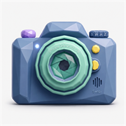

<p align="center">
  
</p>

<h1 align="center">LowPolyCam</h1>

<p align="center">
  <b>A lightweight iOS camera app built for long recordings and low storage use.</b><br>
  Built and tested on iPhone 7 with iOS 15.8.x and newer iPhones.
</p>

---

## 📸 Overview

**LowPolyCam** is made for recording for hours without quickly filling your iPhone.

Choose your resolution, quality, frame rate, and format, then start recording.

Simple, lightweight, and built for long sessions.

---

## ✨ Features

### 🎥 Camera & Recording

* **Resolutions:** 4K, 1080p, 720p, 480p, 320p, 144p
* **Frame rates:** 24, 30, 60 fps
* **Modes:** Video and Slo-Mo
* **Quality:** High, Medium, Low, Data Saver
* **Codecs:** HEVC or H.264
* **Zoom:** 0.5×, 1×, 2×, 5×
* **File splitting:** 1 hour, 4 hours, or one continuous file
* **Save to:** Photos or Files

### 🛠 Pro Tools

* **Exposure:** −2.0 to +2.0 EV
* **White Balance:** Auto, Sunny, Warm, Cool, Golden
* **Horizon Level:** Gyroscope-based level with haptic feedback
* **Hardware Shutter:** Volume buttons can start and stop recording
* **Double-Tap Flip:** Double-tap the viewfinder to switch cameras

### 🔋 Battery & Storage

* **Auto-Dim:** Automatically turns the screen black after 10 seconds while filming.
* **Moon Button:** Manually turns the screen black while recording.
* **Low-Space Protection:** Stops recording below **300 MB** of free space.

### 🛡 Recovery

* Recordings are saved in **4-second fragments** to reduce data loss.
* Interrupted recordings are automatically detected and recovered when the app opens.

### 🎨 Themes

Choose from:

* **Lens Mint**
* **Dial Lavender**
* **Button Gold**
* **Record Red**

The entire interface adapts to the selected theme.

---

## 💾 Storage

Approximate storage usage with **HEVC at 30 fps**:

| Resolution |       High |    Medium |       Low |     Ultra Low |
| ---------- | ---------: | --------: | --------: | ------------: |
| **4K**     | ~10.8 GB/h | ~5.4 GB/h | ~2.7 GB/h |     ~810 MB/h |
| **1080p**  |  ~3.6 GB/h | ~1.8 GB/h | ~900 MB/h |     ~180 MB/h |
| **720p**   |  ~1.8 GB/h | ~900 MB/h | ~450 MB/h | **~123 MB/h** |
| **480p**   |  ~900 MB/h | ~450 MB/h | ~225 MB/h |      ~69 MB/h |
| **320p**   |  ~450 MB/h | ~225 MB/h | ~115 MB/h |      ~47 MB/h |
| **144p**   |  ~180 MB/h |  ~90 MB/h |  ~45 MB/h |      ~29 MB/h |

> 💡 **720p Data Saver uses about 123 MB/hour**, allowing roughly **130 hours** of recording with 16 GB of free storage.

---

## 📱 iOS Notes

* **The screen must stay on.** iOS does not allow normal apps to record from the background.
* Use **Auto-Dim** or the **Moon Button** to turn the screen black while recording.
* Older iPhones may support fewer resolutions, frame rates, or camera features.
* Unsupported options are automatically disabled.

---

## 🔨 Build & Sideload

### GitHub Actions — No Mac Required

1. Push or fork the repository.
2. Open **Actions**.
3. Select **Build unsigned IPA**.
4. Click **Run workflow**.
5. Download the `LowPolyCam-unsigned-ipa` artifact.
6. Sideload the IPA using **AltStore, Sideloadly,** or **TrollStore**.

### macOS + Xcode

Install XcodeGen:

```bash
brew install xcodegen
xcodegen generate
open LowPolyCam.xcodeproj
```

Then select your Apple Developer Team in Xcode and build the app.

---

## 📱 Tested On

**iPhone 7 — iOS 15.8.x**

Also designed to adapt to newer iPhones and their available camera hardware.
